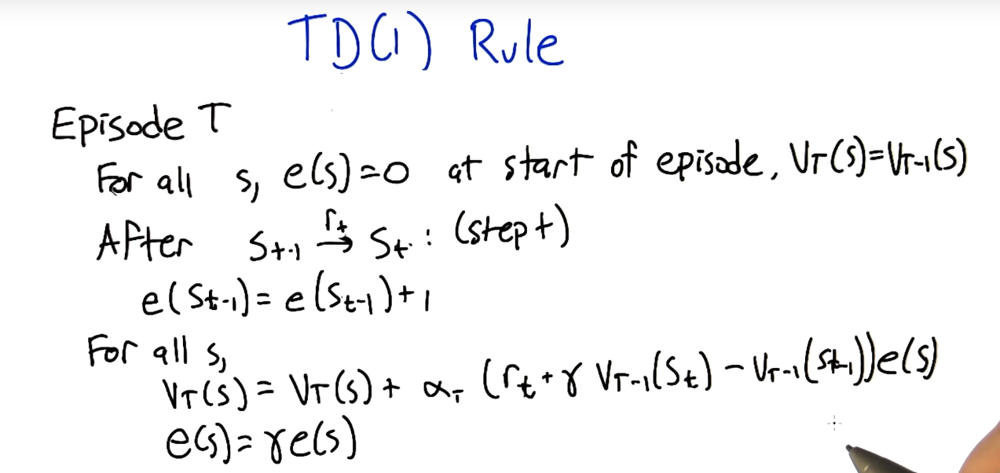
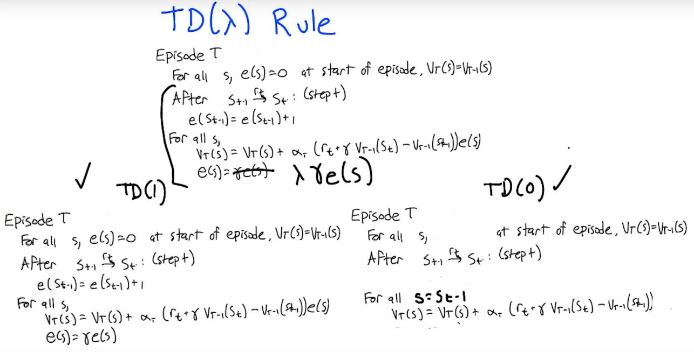

## TD and Friends

__RL Context__
- $\langle s, a, r\rangle ^* \rightarrow$ RL algo $\rightarrow \pi$
- model-based (more supervised, less direct learning): 
    - $\langle s, a, r\rangle ^* \leftrightarrow$ model learner $\rightarrow T, R \rightarrow$ MDP solve $\rightarrow Q^* \rightarrow$ argmax $\rightarrow \pi$ 
- value-function based (model-free): 
    - $\langle s, a, r\rangle ^* \leftrightarrow Q \rightarrow$ argmax $\rightarrow \pi$ 
- policy search (more supervised, less direct learning): 
    - $\langle s, a, r\rangle ^* \rightarrow$ policy update $\leftrightarrow \pi$ 

__TD($\lambda$) basics__
- Computing estimates incrementally
    - $V_{T}(s) = \frac{(T-1)V_{T-1}(s) + R_T(s)}{T} = \frac{T-1}{T}V_{T-1} + \frac{1}{T}R_T(s) = V_T(s) + \alpha_T (R_T(s) - V_{T-1}(s))$, where $\alpha_T = \frac{1}{T}$
    - interpretation: value is updated by the difference b/w the return at current time and value at previous time
    - Isbell: looks like perceptron update (the diff is error)
- properties of learning rates
    - if $\sum_T \alpha_T = \infty$ and $\sum_T \alpha_T^2 < \infty$, then $\lim_{T\rightarrow \infty}{V_T(s) = V(s)}$
    - interpretation: sum of alphas must be big enough to move to true value, but not so big they hide noise 

__TD(1)__
- let $e(s)$ be the elligibility of $s$ (kind of like a filter for application of the rule that reflects age of states)
- $V_T(s) = V_T(s) + \alpha_T(r_t+\gamma V_{T-1}(s_t) - V_{T-1}(s_{t-1}))e(s)$
- Big idea: telescoping series on updating values
- behaves like an infinte-step ahead estimator
- update rule: 
    
- $\Delta V_T(s_n) = \alpha(r_n + \gamma r_{n+1} + \gamma^2 r_{n+2} + ... + \gamma^{N-1} V_{T-1}(s_N) - V_{T-1}(s_n)) = $ "what you predicted for val of s vs. what value of s was last episode"
- TD(1) is the same outcome-based updates (if no repeated states) 
    - TD(1) allows for extra learning when repeating a state
- maximum likelihood estimate can be better than outcome-based TD(1) since it uses more data (see [here](https://classroom.udacity.com/courses/ud600/lessons/4178018883/concepts/43095686540923) for more)

__TD(0)__
- equivalent to maximum likelihood estimate? 
- removes elligibility vector
- behaves like a 1-step ahead estimator

__TD($\lambda$)__
- updates based on differences b/w temporally successive predictions
- rules comparison: 
    
- if $\lambda$ is not 0 or 1, TD($\lambda$) is a weighted combination of all k-step estimators 