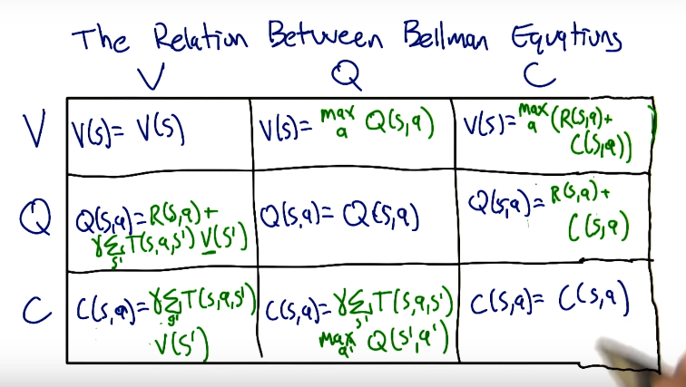

## Markov Decision Process
- only present matters
- stationary model (rules of game don't change)

__Problem__:
- states : \(s\)
- model : \(T(s,a,s') \sim Pr(s'|s,a)\)
- actions : \(a\)
- reward : \(R, R(s)\)

__Policy: a "solution" to a MDP problem__
- \(\pi(s) \rightarrow a \) (policy maps states to actions)
- \(\pi^*\) maximized the total cummulative reward 

__RL vs Supervised Learning__
- in SL the input is \(\langle s, a \rangle\) tuples (a is correct action in s)
- in RL the input is \(\langle s, a, r \rangle\) tuples (r is reward for a in s)
- MDPs have delayed rewards

__Rewards__
- temporal credit assingment problem: how to rate past choices in problems with delayed rewards
- small negative reward in each state other than game ending states (goal/lava) trains the ideal policy \(\pi^*\) 
    - large positive reward makes a policy that avoids goal (since endless traversal is better)
    - large negative reward makes a policy that can choose the lava (positive of goal not enough to outweigh negative of long journey)
- in MDPs minor changes matter

__Sequences of Rewards__
- infinite vs finite horizons (this course is infinite only) 
- utility of sequences: if \(U(s0, s1, ..) > U(s0, s1', ..)\), then \(U(s1, s2, ..) > (s1', s2', ..) \)
    - note this is equivalent to the stationary model requirement of MDP
    - what is a good utility function? 
        - then \( U(s0, s1, ..) = \sum_t(R(s_t)) \), but in this case any countably infinite sum is equivalent for unending games (if you live forever, it doesn't matter what you do)
        - "discounted rewards" - instead use \( U(s0, s1, ..) = \sum_t(\gamma^t R(s_t)) \) where \(|\gamma| < 1 \) -- this is a geo series that converges 
        - so \( U(s0, s1, ..) \leq \sum_t(\gamma^t R_{max}) = R_{max}/(1-\gamma) \)

__Policies__
- \(\pi^* = \text{argmax}_{\pi} E[\sum_t{\gamma^t R(s_t)} | \pi] = \) the policy that maximizes expected value of reward
- \(U^{\pi}(s) = E[\sum_t{\gamma^t R(s_t)} | \pi, s_0 = s] \neq R(s) \)
- Reward is immediate, utility is long term value of policy
- Usually we use \(U(s) = U^{\pi^*}(s)\) -- "true utility of a state"
- \(\pi^*(s) = \text{argmax}_a \sum_{s'}{T(s, a, s') U(s')} \)
    - knowing true utility means you can find optimal policy
- __Bellman Equation:__ \(U(s) = R(s) + \gamma \max_a \sum_{s'}{T(s, a, s') U(s')} \)
    - how to solve? n equations (one for each utilities) and n unknowns (utilities), but not linear equations (due to max)
    - algo to solve (__value iteration__):  (proof of convergence on slide 25 [here](https://s3.amazonaws.com/ml-class/notes/MDPIntro.pdf))
        - start with arbitrary utilities
        - update utilities based on neighbors
        - repeat update step until convergence
    - Ex.  
        notes: Don't forget the transition probabilities: 0.8 of going in the desired direction, and 0.1 of going in each of the directions at 90-degrees, \(U_0(green) = 1\), \(U_0(red) = -1\)
        - \(U_1(x) = -0.04 + 0.5[0 + 0 + 0.8*1] = 0.36\)
        - \(U_2(x) = -0.04 + 0.5((0.1)(-0.4) + (0.1)(0.36) + 0.8*1) = 0.376\)
    - the optimal policy can be found even if the true utility is not found (order of actions is all that is needed)
    - find policy (__policy iteration__): 
        - start with \(\pi_0\)
        - evaluate: given \(\pi_t\) calculate \(U_t = U^{\pi_t}\), where \(U_t = R(s) + \gamma \sum_{s'}{T(s, \pi_t(s), s') U_t(s')} = \) reward + gamma*expected utility 
        - improve: \(\pi_{t+1} = \text{argmax}_a \sum{T(s, a, s') U_t(s')}\)
    - the algo above is now linear (no max to find \(U_t\))

__More on Bellman__
- other ways to express Bellman: 
    - value of state \(= V(s) = \max_a (R(s,a) + \gamma \sum_{s'}{T(s,a,s')V(s')})\)
    - quality of a state,action \(= Q(s,a) = R(s,a) + \gamma \sum_{s'}{T(s,a,s') ~ \max_{a'}Q(s',a')}\)  --  useful when you don't know R and T
    - continuation of state,action \(= C(s,a) = \gamma \sum_{s'}{T(s,a,s') ~ \max_{a'}(R(s',a')+C(s',a'))}\)
- Ex. 
    Soln:  

