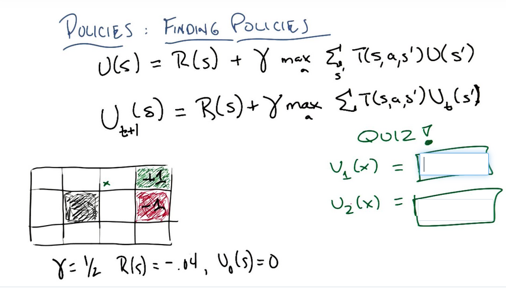
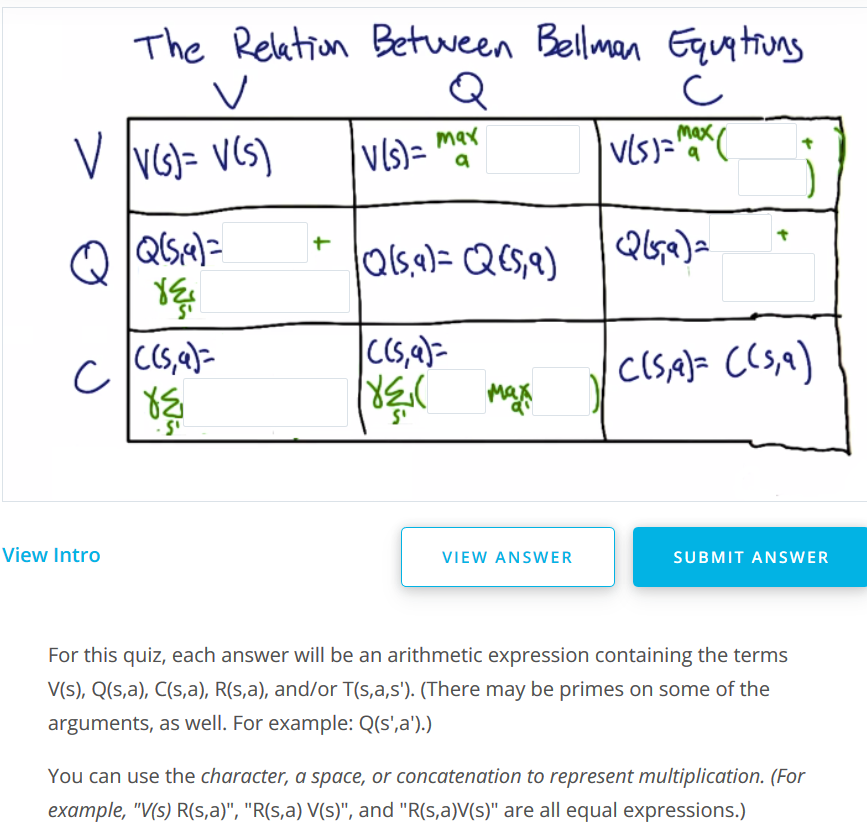
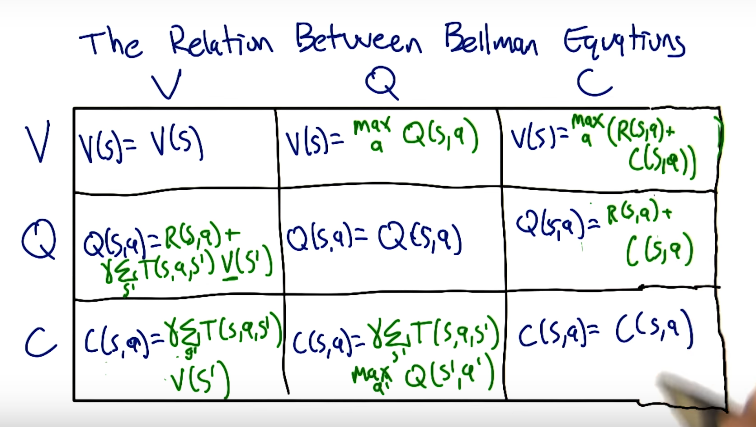

##  Markov Decision Process
  
- only present matters
- stationary model (rules of game don't change)
  
__Problem__:
- states : 
- model : 
- actions : 
- reward : 
  
__Policy: a "solution" to a MDP problem__
-  (policy maps states to actions)
-  maximized the total cummulative reward 
  
__RL vs Supervised Learning__
- in SL the input is  tuples (a is correct action in s)
- in RL the input is  tuples (r is reward for a in s)
- MDPs have delayed rewards
  
__Rewards__
- temporal credit assingment problem: how to rate past choices in problems with delayed rewards
- small negative reward in each state other than game ending states (goal/lava) trains the ideal policy  
    - large positive reward makes a policy that avoids goal (since endless traversal is better)
    - large negative reward makes a policy that can choose the lava (positive of goal not enough to outweigh negative of long journey)
- in MDPs minor changes matter
  
__Sequences of Rewards__
- infinite vs finite horizons (this course is infinite only) 
- utility of sequences: if , then 
    - note this is equivalent to the stationary model requirement of MDP
    - what is a good utility function? 
        - then , but in this case any countably infinite sum is equivalent for unending games (if you live forever, it doesn't matter what you do)
        - "discounted rewards" - instead use  where  -- this is a geo series that converges 
        - so 
  
__Policies__
-  the policy that maximizes expected value of reward
- 
- Reward is immediate, utility is long term value of policy
- Usually we use  -- "true utility of a state"
- 
    - knowing true utility means you can find optimal policy
- __Bellman Equation:__ 
    - how to solve? n equations (one for each utilities) and n unknowns (utilities), but not linear equations (due to max)
    - algo to solve (__value iteration__):  (proof of convergence on slide 25 [here](https://s3.amazonaws.com/ml-class/notes/MDPIntro.pdf ))
        - start with arbitrary utilities
        - update utilities based on neighbors
        - repeat update step until convergence
    - Ex.  
        notes: Don't forget the transition probabilities: 0.8 of going in the desired direction, and 0.1 of going in each of the directions at 90-degrees, , ~ 
        - 
        - 
    - the optimal policy can be found even if the true utility is not found (order of actions is all that is needed)
    - find policy (__policy iteration__): 
        - start with 
        - evaluate: given  calculate , where  reward + gamma*expected utility 
        - improve: 
    - the algo above is now linear (no max to find )
  
__More on Bellman__
- other ways to express Bellman: 
    - value of state 
    - quality of a state,action   --  useful when you don't know R and T
    - continuation of state,action 
- Ex. 
    Soln:  
  
  